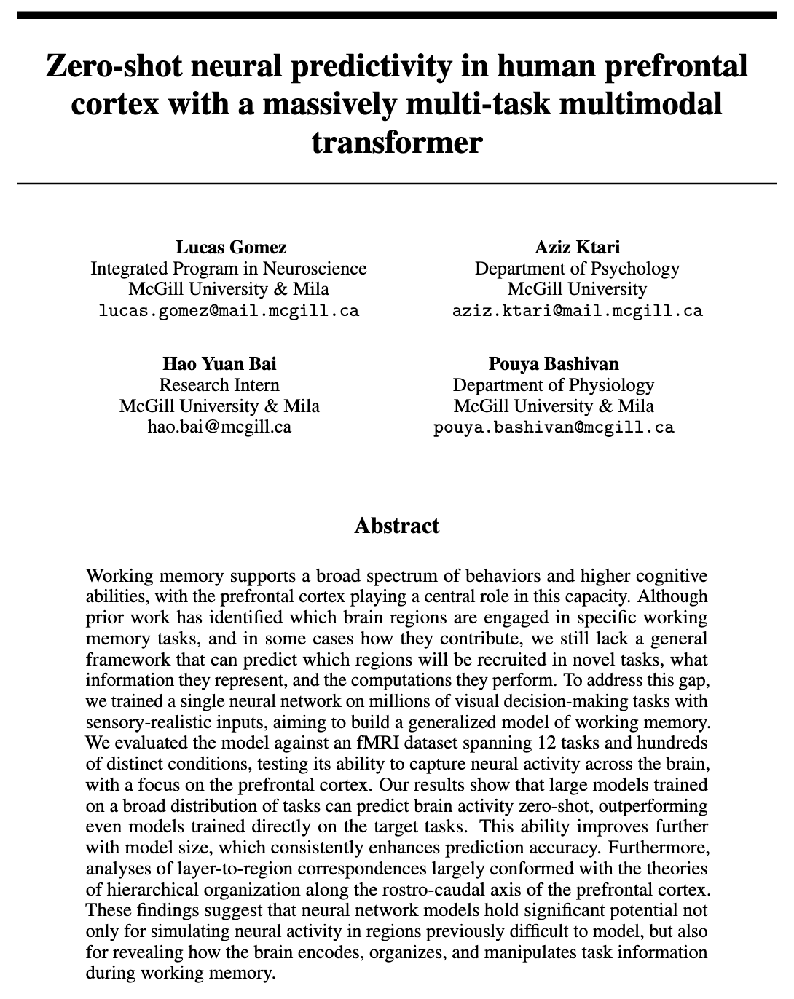

## Snapshot of code for...

  

The paper and poster was presented at the [Data on the Brain & Mind](https://data-brain-mind.github.io/) NeurIPS 2025 Workshop. You can find the paper [here](https://openreview.net/forum?id=YoS4Wc2WYo) on openreview.

As the workshop paper is non-archival we are unable share the full repository (training, data, etc.). Once the full work is published this repository will be updated to show the full code. 

## Models & Modules Snapshot

I created a modular framework for modeling the visual working-memory tasks.

We tested three types of **Core Action Decoders**: LSTM, Mamba2, and Transformer. 

You can see the implementation of these and other functions like masking in the files described below...

#### 📁 Structure 📁

- **models/**   
  - [rnn.py](models/rnn.py)   
  - [ssm.py](models/ssm.py)  
  - [transformer.py](models/transformer.py)
  - **modules/**
    - [activations.py](models/modules/activations.py)
    - [attentions.py](models/modules/attentions.py)
    - [masking.py](models/modules/masking.py)
    - [positionals.py](models/modules/positionals.py)
